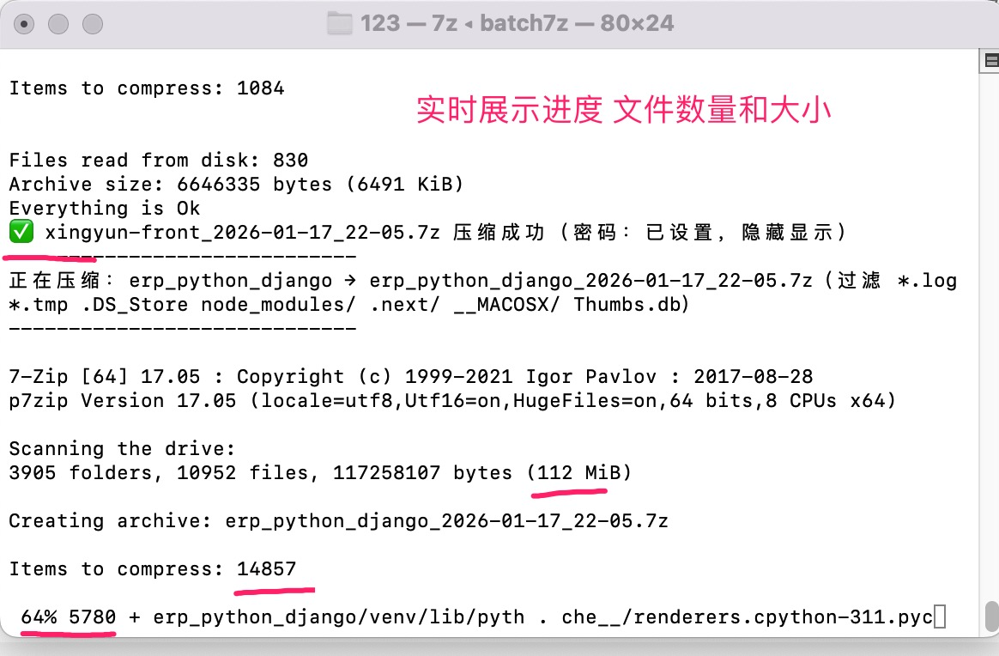

# 📦 Batch7z - 高效批量压缩/解压工具

> 一键备份，轻松还原！Batch7z 是一款专为开发者设计的命令行工具，让批量压缩和解压变得前所未有的简单高效。

**[English README](README.md)**

**✨ 核心特性：**
- 🚀 **极速压缩**：基于 LZMA2 算法，压缩比高达 70%，大幅节省存储空间
- 📁 **智能打包**：自动识别子目录和文件，智能排除已压缩格式和临时文件
- 🔒 **灵活加密**：支持无密码或自定义密码，满足不同安全需求
- 🌍 **跨平台支持**：提供 Bash 和 PowerShell 双版本，完美适配 Windows/macOS/Linux
- 🎯 **精准控制**：支持目录层级剥离（strip）和强制覆盖，灵活应对各种场景

**💡 适用场景：**
- 项目快速备份与迁移
- 服务器部署包批量打包
- 多版本项目归档管理
- 开发环境一键备份还原

## 功能特性

- **batch7z**: 批量压缩目标目录下的一级子目录为 .7z 压缩包
- **batchun7z**: 批量解压 .7z 格式压缩包，支持目录层级剥离（strip）和强制覆盖
- 高压缩比（LZMA2 算法）
- 自动过滤不必要的文件（*.log、.DS_Store、node_modules 等）
- 支持可选设置压缩/解压密码

## 📋 系统要求

### macOS/Linux (Bash 版本)

**macOS:**
```bash
brew install p7zip
```

**Linux:**
```bash
# Debian/Ubuntu
sudo apt-get install p7zip-full

# Arch Linux
sudo pacman -S p7zip
```

### Windows/macOS/Linux (PowerShell 版本)

**Windows:**
- 下载并安装 7-Zip：https://www.7-zip.org/

**macOS:**
```bash
brew install p7zip
pwsh  # 安装 PowerShell
```

**Linux:**
```bash
# 安装 p7zip
sudo apt-get install p7zip-full  # Debian/Ubuntu
sudo pacman -S p7zip            # Arch Linux

# 安装 PowerShell
# 参考官方文档：https://docs.microsoft.com/zh-cn/powershell/scripting/install/installing-powershell
```

📖 **详细说明**：查看 [PowerShell 版本使用说明](POWERSELL_USAGE.md)

## ⚡ 快速开始

### Bash 版本 (macOS/Linux)

```bash
# 克隆或下载脚本
git clone <repository-url>
cd batch7z

# 安装依赖
brew install p7zip  # macOS
# 或
sudo apt-get install p7zip-full  # Linux

# 添加执行权限
chmod +x batch7z batchun7z

# 开始使用
./batch7z -d /path/to/project
./batchun7z -d /path/to/restore
```

### PowerShell 版本 (Windows/macOS/Linux)

```powershell
# Windows
# 下载并安装 7-Zip: https://www.7-zip.org/
.\batch7z.ps1 -d "C:\path\to\project"
.\batchun7z.ps1 -d "C:\path\to\restore"

# macOS/Linux
# 安装 p7zip 和 PowerShell
brew install p7zip pwsh

# 运行脚本
pwsh -File ./batch7z.ps1 -d "/path/to/project"
pwsh -File ./batchun7z.ps1 -d "/path/to/restore"
```

---

## 📖 使用说明

### batch7z - 批量压缩

将目标目录下的一级子目录批量压缩为 .7z 包。

**基本用法：**
```bash
batch7z                          # 压缩当前目录所有子目录
batch7z -d /path/to/dir          # 压缩指定目录
batch7z -p 123456                # 使用自定义密码
batch7z -h                       # 显示帮助信息
```

**使用示例：**

1. 备份当前项目的所有子目录：
```bash
cd /Volumes/work/wwwroot
batch7z
```

2. 压缩指定目录并设置密码：
```bash
batch7z -d ~/Desktop/projects -p mypassword
```

3. 压缩多个部署包，方便传输：
```bash
cd /var/www/vhosts
batch7z -p deploy2026
```

**配置说明：**
- 压缩格式：.7z（兼容 WinRAR、BetterZip、7-Zip 等）
- 压缩算法：LZMA2 (xz)
- 自动过滤：`*.log`、`*.tmp`、`.DS_Store`、`node_modules/`、`.next/`
- 已压缩格式（不再打包）：.7z、.rar、.gz、.zip、.tar、.iso、.dmg 等
- 文件命名：
  - 子目录：`子目录名_YYYY-MM-DD_HH-MM.7z`
  - 文件：`当前目录名_files_YYYY-MM-DD_HH-MM.7z`
- 默认密码：不设置密码（可选设置）

---

### batchun7z - 批量解压

批量解压当前目录下所有 .7z 格式压缩包，支持目录剥离和强制覆盖。

**基本用法：**
```bash
batchun7z                        # 解压当前目录所有压缩包
batchun7z -d /path/to/dir        # 解压到指定目录
batchun7z -p 123456              # 使用自定义密码
batchun7z -s 2                   # 剥解前 2 层目录
batchun7z -f                     # 强制覆盖已存在文件
batchun7z -h                     # 显示帮助信息
```

**使用示例：**

1. 还原当前目录的所有备份包：
```bash
cd /Volumes/work/wwwroot
batchun7z
```

2. 解压到指定目录并设置密码：
```bash
batchun7z -d ~/Desktop/restore -p mypassword
```

3. 剥离嵌套目录结构：
```bash
# 压缩包内：a/b/c/app/index.js
# 使用 -s 2 后：app/index.js
batchun7z -s 2
```

4. 强制覆盖更新（跳过已存在文件）：
```bash
batchun7z -f
```

**配置说明：**
- 支持格式：.7z（仅支持 batch7z 生成的压缩包）
- strip 功能：剥离压缩包内文件的前 N 层目录
- 默认行为：跳过已存在文件，不剥离目录
- 默认密码：不设置密码（可选设置）

---

## 🔄 工作流程

### 压缩流程（batch7z）
1. 扫描目标目录下的一级子目录
2. 为每个子目录创建独立的 .7z 压缩包
3. 应用文件过滤规则（排除日志、临时文件等）
4. 使用 LZMA2 算法进行高比率压缩
5. 可选为压缩包设置密码保护
6. 生成带时间戳的文件名
7. 打包当前目录下的非压缩文件（排除已压缩格式）

### 解压流程（batchun7z）
1. 扫描当前目录下的所有 .7z 文件
2. 验证密码并解压到临时目录
3. 根据 strip 设置剥离指定层级的目录
4. 根据覆盖设置处理已存在文件
5. 清理临时目录，完成解压

## ⚠️ 注意事项

- 确保 7z 命令已正确安装并添加到 PATH
- 批量操作前建议先测试小批量数据
- 密码包含特殊字符时请使用引号包裹
- strip 功能会修改目录结构，请谨慎使用
- 默认不设置密码，如需加密请使用 -p 参数
- 当前目录的文件打包功能会自动排除已压缩格式

## 📁 文件清单

| 文件 | 平台 | 说明 |
|------|------|------|
| `batch7z` | macOS/Linux | Bash 版批量压缩工具 |
| `batchun7z` | macOS/Linux | Bash 版批量解压工具 |
| `batch7z.ps1` | Windows/macOS/Linux | PowerShell 版批量压缩工具 |
| `batchun7z.ps1` | Windows/macOS/Linux | PowerShell 版批量解压工具 |
| `README.md` | - | 项目说明文档 |
| `POWERSELL_USAGE.md` | - | PowerShell 版本详细使用说明 |

## 🆚 版本对比

| 特性 | Bash 版本 | PowerShell 版本 |
|------|-----------|----------------|
| 运行环境 | macOS/Linux | Windows / macOS / Linux |
| 命令格式 | `./batch7z` | `.\batch7z.ps1` 或 `pwsh -File ./batch7z.ps1` |
| 功能特性 | 完全相同 | 完全相同 |
| 配置参数 | 完全相同 | 完全相同 |
| 跨平台 | 仅 Unix 系统 | 全平台支持 |
| 推荐场景 | macOS/Linux 开发环境 | Windows 开发环境或跨平台需求 |

## 📊 典型使用场景

### 场景 1：项目快速备份
```bash
# 备份整个项目目录（包含所有子目录和文件）
cd ~/projects/myproject
./batch7z -p "backup2026"

# 生成：
# - app_2026-01-16_14-30.7z
# - lib_2026-01-16_14-30.7z
# - myproject_files_2026-01-16_14-30.7z（包含 README.md、package.json 等）
```

### 场景 2：服务器部署包批量打包
```bash
cd /var/www/vhosts
./batch7z -p "deploy2026"

# 每个站点独立打包，方便分发给不同的服务器
```

### 场景 3：跨平台数据迁移
```bash
# 在 macOS 上打包
./batch7z -d ~/Documents/projects -p "migrate"

# 在 Windows 上解压
.\batchun7z.ps1 -d "C:\Projects\Restore" -p "migrate"
```

### 场景 4：剥离嵌套目录结构
```bash
# 压缩包内：project/src/2025/backup/app/index.js
# 使用 -s 3 后：app/index.js
./batchun7z -s 3
```

## screenshot




## 🤝 贡献

欢迎提交问题和改进建议！

## 📄 许可证

本项目工具仅供个人使用。
